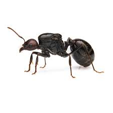
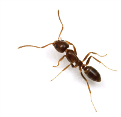
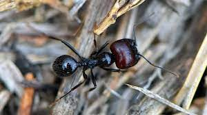
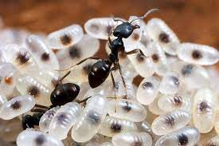

# Hierarchy Ants Detector App

Este es un programa simple de inteligencia artificial que utiliza un modelo YOLOv8 entrenado con imágenes de hormigas de distintas jerarquías: obreras pequeñas (minor), obreras medianas (medior), obreras grandes o soldados (soldier), reinas (queen) y huevos (eggs). La aplicación permite cargar un archivo de video y realizar diferentes acciones de análisis sobre él utilizando el modelo de detección de hormigas.

## Requisitos

Asegúrate de tener instaladas todas las dependencias necesarias para ejecutar la aplicación. Puedes instalarlas ejecutando:

```bash
pip install -r requirements.txt
```

## Uso

Para ejecutar la aplicación, simplemente ejecuta el script `main.py`:

```bash
python main.py
```

Una vez ejecutado, se te pedirá que selecciones un archivo de video. Después, se abrirá una ventana con un botón para realizar la siguiente acción:

- **Detectar:** Realiza la detección de hormigas en el video cargado.

## Imágenes detectables

### **Hormiga reina**
La reina es la hembra reproductora principal de la colonia. Tiene un tamaño considerablemente mayor que el de las obreras y soldados, y su función principal es la de poner huevos para mantener y hacer crecer la colonia. La reina es la única hembra fértil en la colonia y su longevidad es significativamente mayor que la de las obreras.


---
### **Hormiga Obrera**
Las obreras son las hormigas que conforman la mayoría de la colonia. Tienen cuerpos robustos y están especializadas en realizar una variedad de tareas, como la recolección de alimentos, la construcción y reparación del hormiguero, el cuidado de las larvas y la defensa de la colonia. Sus mandíbulas son fuertes y están adaptadas para llevar a cabo diversas actividades dentro y fuera del hormiguero.


---
### **Hormiga Soldado**
Las soldados son hormigas obreras especializadas en la defensa del hormiguero. Tienen mandíbulas más grandes y poderosas que las obreras comunes, lo que les permite proteger eficazmente la colonia contra posibles amenazas como otros insectos depredadores o intrusiones humanas.


---
### **Huevos, larvas y pupas (prole)**
Los huevos de hormigas son la etapa inicial del ciclo de vida de estos insectos. Son pequeños, ovalados y generalmente de color blanco. Después de ser depositados por la reina en el hormiguero, los huevos son cuidados y protegidos por las obreras hasta que eclosionan y dan lugar a larvas, que luego se convertirán en pupas y finalmente emergerán como hormigas adultas. Los huevos son fundamentales para el crecimiento y la supervivencia de la colonia.



## Créditos

Este proyecto utiliza un modelo YOLOv8 entrenado con imágenes de hormigas proporcionadas por Roboflow.

## Contribuciones

Las contribuciones son bienvenidas. Si deseas mejorar esta aplicación, por favor envía un pull request.